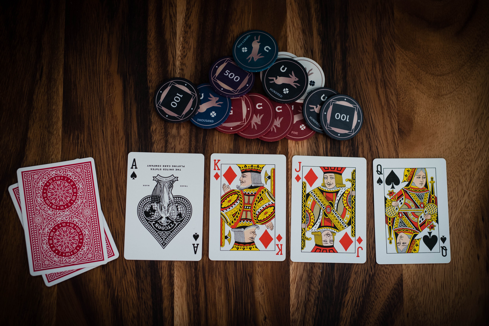

  

<h3 align="center">Poker Square</h3>

---

 Let's play a game of Poker Square!
      

## 📝 Table of Contents

- [About](#about)
- [Getting Started](#getting_started)
- [Deployment](#deployment)
- [Usage](#usage)
- [Built Using](#built_using)
- [TODO](../TODO.md)
- [Authors](#authors)
- [Acknowledgments](#acknowledgement)

## 🧐 About 

An app to play a game of Poker Square!

## 🏁 Getting Started 

These instructions will get you a copy of the project up and running on your local machine for development and testing purposes. See [deployment](#deployment) for notes on how to deploy the project on a live system.

### Prerequisites

What things you need to install the software and how to install them.

1. A package manager (e.g. npm or yarn)
2. A server environment (e.g. Node)
3. A code editor (e.g. VS Code or Atom)

### Installing

1. Download the repo
2. Install the packages (npm install or yarn install)
3. The code can be editted with any code editor
4. Start a dev server with `npm install` or `yarn install` as appropriate

## 🎈 Usage 

With the dev server deployed, open a browser to Localhost:3000. Alternately, an optimized production build can be created with `npm run build` or `yarn run build`, which will create a build folder with an html file that can be opened.

## 🚀 Deployment 

All that should be required for deployment is the code and a browser to run it in.

## ⛏️ Built Using 

- [NodeJs](https://nodejs.org/en/) - Server Environment
- [Create React App](https://github.com/facebook/create-react-app) - Code Framework

## ✍️ Authors 

- [@Sudolphus](https://github.com/Sudolphus)

<!-- ## 🎉 Acknowledgements 

- Hat tip to anyone whose code was used
- Inspiration
- References -->
